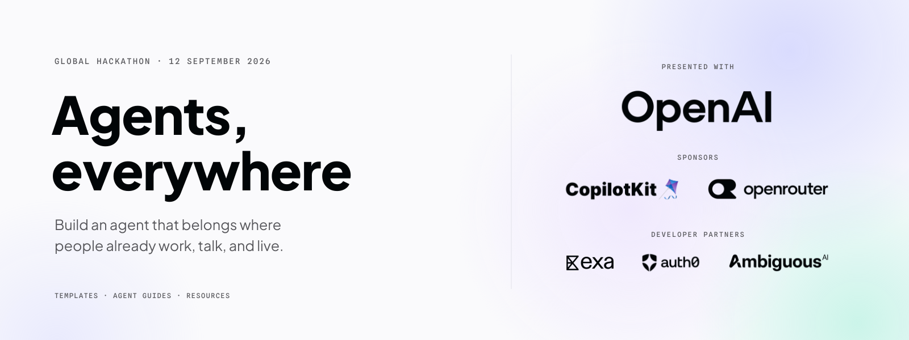

<div align="center">

# Agents, Everywhere Hackathon Starter Kit



**Build an agent that belongs where people already work, talk, and live.**

[Wyatt](#wyatt) · [Overview](#overview) · [Get started](#get-started) · [Templates](#templates) · [Coding agent](#coding-agent) · [Resources](#resources)

</div>

## Wyatt

Wyatt is a procurement agent for the ops person at a small company. Ask it in Slack, or in the chat panel of the WyattERP console: "Need 4000 ballpoint pens by Friday". Wyatt:

1. Matches the request to the catalog, asking when more than one item fits, and turns "Friday" into a date.
2. Drafts a requisition.
3. After you approve, emails a request for quotation (RFQ) to the right suppliers, each with a personal magic link.
4. Collects each supplier's quote through the portal.
5. Ranks the quotes (on time first, then price, then lead time) and recommends one.
6. After you approve, issues a purchase order and emails it to the supplier.

Both surfaces share the same database and service layer, so a request started in Slack appears in WyattERP straight away.

| Piece | Path | Port |
|---|---|---|
| Slack agent: CopilotKit Channels, native cards and approval buttons | `apps/channel` | 3000 (health only) |
| WyattERP console + agent chat panel (Vite, React, CopilotKit React) | `apps/erp-frontend` | 5173 |
| ERP chat agent (CopilotKit runtime, OpenRouter or OpenAI via `agent-core`) | `apps/procure-agent` | 3002 |
| Service layer + supplier portal (Express) | `apps/api` | 3001 |
| Schema, migrations, seed, shared queries, quote ranking | `packages/procure-db` | — |
| Postgres, Redis, Mailpit (local email inbox), Adminer (database browser) | `docker-compose.yml` | 5434, 6381, 1026/8026, 8081 |

### Quickstart

Needs Node 22+ and Docker.

```bash
npm install
cp .env.example .env        # then set MODEL_PROVIDER=openrouter, OPENROUTER_API_KEY, MODEL,
                            # and a random JWT_SIGNING_SECRET (openssl rand -hex 32)
npm run db:up               # Postgres, Redis, Mailpit, Adminer
npm run db:migrate
npm run db:seed             # sample catalog and suppliers (example.com addresses)

# three terminals
npm run dev:api
npm run dev:agent
npm run dev:erp             # open http://localhost:5173
```

Supplier emails land in Mailpit at http://localhost:8026. Open a magic link there to submit a quote as that supplier. To browse the database, open Adminer at http://localhost:8081/?pgsql=postgres&username=procurebot&db=procurebot (password `procurebot`). `npm run verify` typechecks and runs the offline tests for every workspace. To start from an empty database, run `docker compose down -v`, then `db:up`, `db:migrate` and `db:seed`.

### Add the Slack surface

The Slack agent needs Postgres and `npm run dev:api` running, because it sends RFQs and POs through the api.

1. Create a managed Channel in a CopilotKit Intelligence project (`npm run channel:setup`, or the dashboard) and create the Slack app from **that Channel's manifest**.
2. **In Slack, open OAuth & Permissions → Reinstall to Workspace → Allow**, then give the Channel the bot token from *after* the reinstall. If the first install granted only some of the manifest's scopes, Slack silently sends no events: the dashboard still says "Setup complete" and the bot never replies.
3. Put the project's key in `.env`. `npx copilotkit@latest project select --project <slug>` writes it as `CPK_INTELLIGENCE_API_KEY`, and `INTELLIGENCE_API_KEY` also works. Set `CHANNEL_CODE` to the Channel's name.
4. Run `npm run dev:slack`, which should print `✓ Channel "<name>" online`. Run **only one** listener per Channel; a second one takes deliveries away from the first.
5. `/invite @<bot>` in a channel, where it posts a welcome card. Then @-mention it with a request, picking the bot from autocomplete: a typed `@name` isn't a mention.

### What is real and what is sample data

- **Sample data:** the catalog items and suppliers are seeded, with no stock on hand.
- **Local email only:** RFQ and PO emails are real SMTP sends, but go to the local Mailpit capture unless you point `SMTP_*` at a real server.
- **Approval gate:** sending RFQs and issuing POs happen only when someone clicks an approval card in Slack or WyattERP. Neither agent has a tool that sends email or creates a PO.
- **Quotes appear when asked for in Slack:** WyattERP pages refresh as quotes arrive. In Slack, Wyatt shows new quotes when someone asks ("any quotes yet?"); it doesn't yet post into the thread by itself.
- **Session-only Slack state:** which request a thread is about, and the approval buttons, are held in the Slack listener's memory. After a restart, ask Wyatt again rather than clicking an old card.
- **No login:** the web requester is a fixed demo user (`web:demo`), and Slack requests belong to the Slack user who made them.
- **Queued jobs:** submitting a quote queues a `quote_submitted` job in Redis, reserved for pushing quotes into Slack threads. Nothing consumes it yet.

---

## Overview

Build for **[Agents, Everywhere: Bots, Channels, & More](https://aitinkerers.org/hackathons/global/agents-everywhere)**, the AI Tinkerers global hackathon on **September 12–13, 2026**. Choose your city on the event page for its local schedule. Put an agent inside a conversation, an app, a phone, or a physical environment. Make the context of that place essential to what it can do.

This kit gives you three runnable templates, files to hand to your coding agent, and sponsor setup notes. Pick a user, a problem, and one complete interaction. You can use any stack; you do not need every sponsor or every surface.

Your project and its core functionality must be created during the event. Existing libraries, templates, and starter code are allowed; describe what you reuse and what you build. Read [the rules](hackathon-rules.md), then follow your city's participant portal for the current deadline and judging criteria.

## Get started

Use Node.js 22+, then clone and install the kit:

```bash
git clone https://github.com/CopilotKit/agents-everywhere-starter-kit.git
cd agents-everywhere-starter-kit
npm ci
cp .env.example .env
```

Choose one template and configure only the credentials it needs. Slack and web use the root install; React Native has its own install under `apps/mobile` because Expo pins its React Native stack separately.

Paste this into your coding agent:

```text
Read AGENTS.md, hackathon-overview.md, hackathon-rules.md, and
using-sponsor-tools.md. Help me choose one template app README for my idea,
then build a new project using its infrastructure. Ask me who it is for and
what the agent should do in that setting. Read the selected template before
editing; for Slack also read .agents/skills/build-channels-agent/SKILL.md.
Use only the integrations the idea needs. Verify a complete interaction and
prepare SUBMISSION.md, distinguishing inherited code from our event work.
```

## Templates

These starting points serve different kinds of context. **CopilotKit Channels** brings the Slack agent into the conversation; **CopilotKit React** connects the web agent to the app people are using; **CopilotKit React Native** brings the same agent pattern onto a phone.

### 1. Slack — an agent that joins the thread

**OpenAI + CopilotKit Channels + Exa**

An agent reads what people already said, researches with Exa, and answers in the same thread with native cards and source links. Start with a support conversation, a research discussion, or a team decision.

The included Slack app supplies thread history, subscriptions, search, and Channels UI. Configure your model, Exa, and a managed Channel, then run `npm run dev:slack`. No public tunnel is needed. Teams or other chat platforms can use the same Channels pattern, but this starter ships the Slack app.

**[Use the Slack template →](apps/channel/)**

### 2. Web — an agent inside your app

**OpenAI + CopilotKit React + Ambiguous AI**

An agent sees the page you are on and turns a request into a real workplace record you can still find after a refresh. Adapt it to customer follow-ups, a project workspace, or a personal planning app.

The included web app supplies page context, frontend tools, agent-rendered UI, and a browser approval step. Connect an Ambiguous AI workspace, then run `npm run dev:web`; approved follow-ups are saved through the server and can be read back after refresh.

**[Use the web template →](apps/web/)**

### 3. React Native — an agent in your pocket

**OpenAI or OpenRouter + CopilotKit React Native**

A mobile agent reads app state, renders native cards, and waits for a tap before changing local sample data. Start with a personal finance assistant, a field checklist, an inventory counter, or any workflow where phone context and approval matter.

The included Expo app supplies seeded finance state, native rendered tool UI, a human-in-the-loop expense approval, and a mobile-specific CopilotKit runtime endpoint served by the web app. Configure your model provider, start `npm run dev:web`, then run the mobile app from `apps/mobile`.

**[Use the React Native template →](apps/mobile/)**

### Make the demo yours

The supplied on-call and finance assistants are **infrastructure examples**: read ambient context, call a tool, render useful UI, and return a verifiable result. Choose a different user, problem, dataset, and interaction; the goal is your own project, not another version of the starter scenario.

Use the [demo prompts](dev-docs/demo-prompts.md) to learn how the pieces connect, then replace the sample domain. In the Slack sample incident flow, approval cards record decisions without executing production actions. In the web follow-up flow, the page approval button saves the reviewed Ambiguous task. In the mobile finance flow, approval changes local in-memory sample data. Enforce the same kind of write boundary around any external action you add.

Want another surface pattern? The web app also includes a voice route, and the shared agent can connect to remote MCP tools when configured. The event surfaces are inspiration, not separate tracks or a requirement to build multiple apps.

## Coding agent

Give your agent these files before it starts coding:

| File | What it provides |
|---|---|
| [hackathon-overview.md](hackathon-overview.md) | The challenge, four surfaces, and official judging criteria |
| [hackathon-rules.md](hackathon-rules.md) | Build eligibility, inherited code, and required deliverables |
| [using-sponsor-tools.md](using-sponsor-tools.md) | Every sponsor featured in this kit: access, authentication, configuration, and a first working call |
| [AGENTS.md](AGENTS.md) | Repository conventions and verification commands |
| [Channels skill](.agents/skills/build-channels-agent/SKILL.md) | Verified Channels APIs for the Slack template |

The app READMEs provide launch commands, files to customize, and a concrete result to check. Start with one template and add a second surface only if it helps your user.

## Resources

| Need | Go here |
|---|---|
| Event details, deadline, and judging | [Find your city](https://aitinkerers.org/hackathons/global/agents-everywhere), then open its participant portal and handbook |
| OpenAI agent development | [Agents SDK quickstart](https://openai.github.io/openai-agents-js/guides/quickstart/) |
| OpenRouter access and model choice | [Quickstart](https://openrouter.ai/docs/quickstart) · [Keys](https://openrouter.ai/keys) · [Model catalog](https://openrouter.ai/models) · [Model switching](dev-docs/model-switching.md) |
| CopilotKit app development | [Docs](https://docs.copilotkit.ai/) · [Tools and context](dev-docs/tools-and-context.md) · [Discord channel for technical questions](https://discord.com/channels/1122926057641742418/1548038338848489532) |
| CopilotKit Channels | [Channels guide](https://copilotkit.ai/channels-guide.md) · [Screenshot walkthrough](dev-docs/channels-sdk-walkthrough/README.md) · [OpenTag example app](https://github.com/CopilotKit/OpenTag) |
| Exa quickstart | [Search API guide](https://exa.ai/docs/reference/search-api-guide) · [Kit setup](using-sponsor-tools.md#exa) |
| Auth0 API authorization | [Node API](https://auth0.com/docs/quickstart/backend/nodejs) · [Kit setup](using-sponsor-tools.md#auth0) |
| Ambiguous AI quickstart | [Developer guide](https://www.ambiguous.ai/llms.txt) · [Kit setup](using-sponsor-tools.md#ambiguous-ai) |
| Rehearse and debug | [Demo prompts](dev-docs/demo-prompts.md) · [Troubleshooting](dev-docs/troubleshooting.md) |
| Prepare your entry | [Submission checklist](SUBMISSION.md) |

For credit redemption instructions, choose your city on the [global event page](https://aitinkerers.org/hackathons/global/agents-everywhere) and check its participant portal's **Credits & Offers** section.

For technical questions during the event, check your city's participant portal and ask your local organizers.

For the Slack/web workspaces, `npm run verify` runs typechecks and offline tests without credentials. The mobile app has its own install, tests, typecheck, and Metro export checks under `apps/mobile`. Each app reports missing configuration when the relevant integration is used. Live sponsor calls and platform delivery require your accounts. See [developer docs](dev-docs/README.md) for detailed setup and deployment.
